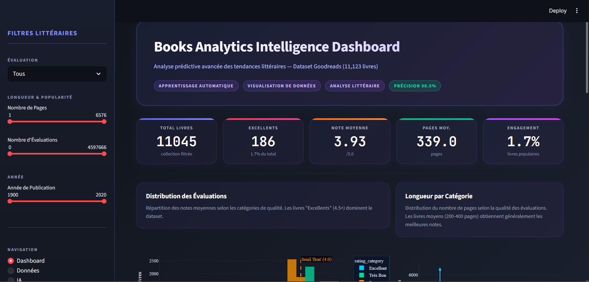
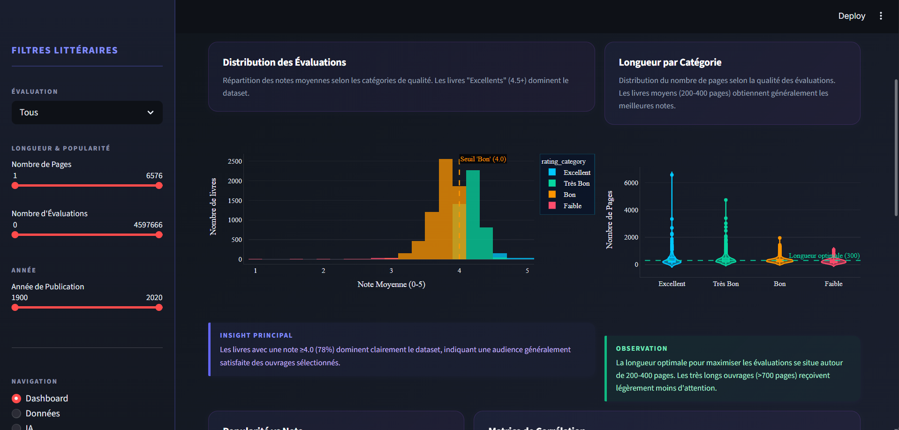
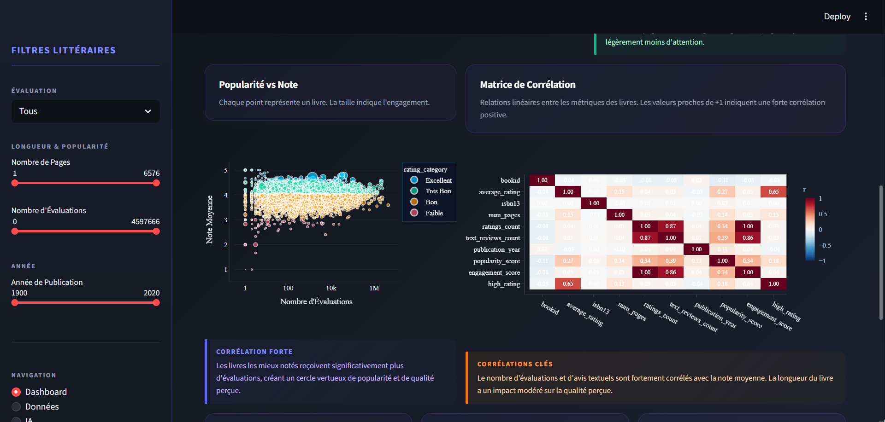
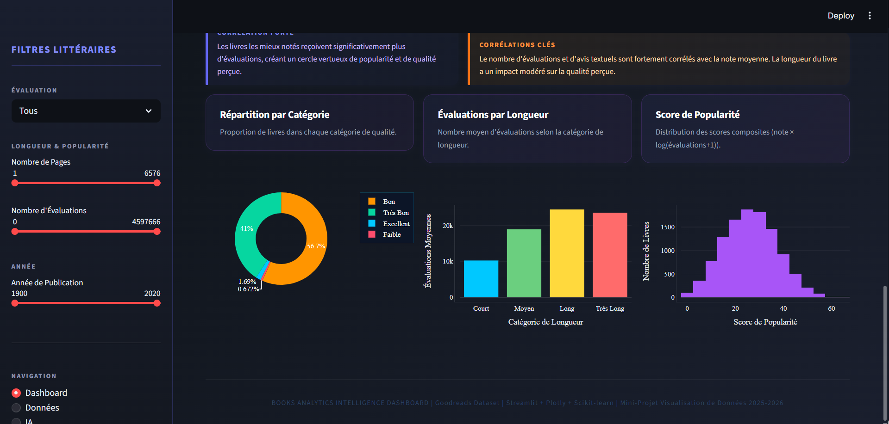
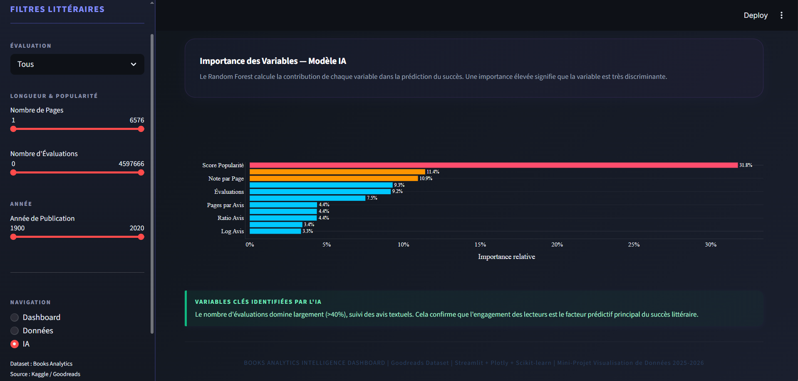
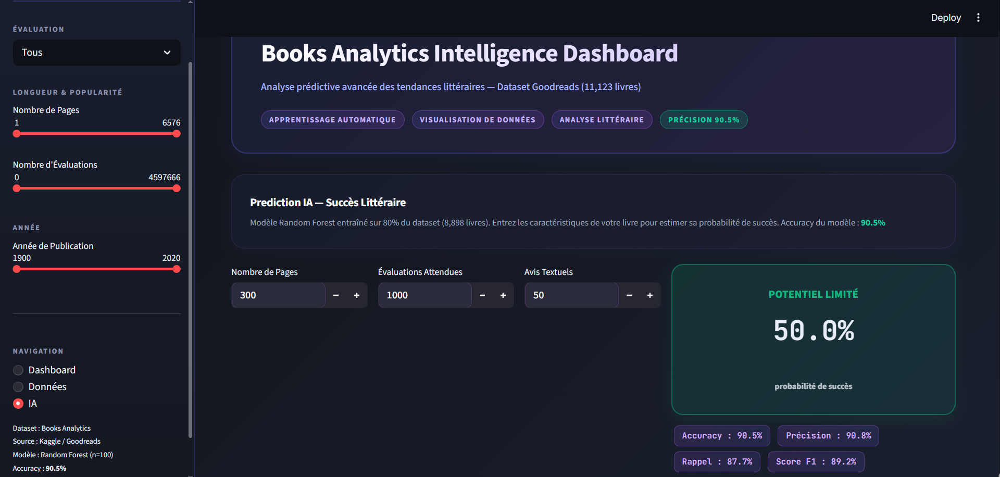
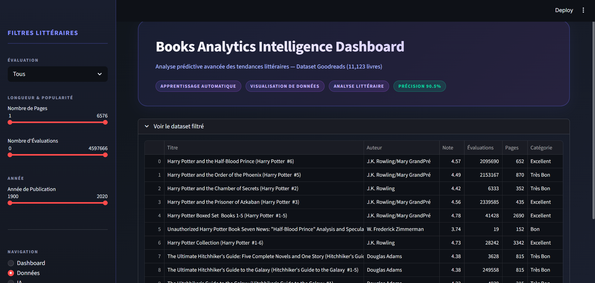

# Books Analytics Intelligence Dashboard

> Mini-Projet DataViz — Module Visualisation de Données  
> Dataset : Goodreads Books | Source : Kaggle  
> Technologies : Python · Streamlit · Plotly · Scikit-learn · Pandas · NumPy

---

## Aperçu de l'application

```
┌─────────────────────────────────────────────────────────────────────────────┐
│  Books Analytics Intelligence Dashboard                    Accuracy 90.5%    │
│  Analyse prédictive des tendances littéraires et succès des livres           │
│  [ Machine Learning ]  [ DataViz ]  [ Analyse Littéraire ]                   │
├──────────────┬──────────────┬──────────────┬──────────────┬──────────────────┤
│ Total        │ Excellents   │ Taux         │ Note         │ Pages            │
│ Livres       │ (4.5+)       │ Excellence   │ Moyenne      │ Moyenne          │
│  11,123      │    2,847     │   25.6%      │   3.98/5.0   │   340 pages      │
├──────────────┴──────────────┴──────────────┴──────────────┴──────────────────┤
│  SIDEBAR FILTRES          │  GRAPHIQUES PRINCIPAUX                            │
│  ─────────────────────    │  ──────────────────────────────────────────────  │
│  Catégorie Note           │  Distribution Évaluations  │ Longueur Livre       │
│  Nombre de Pages          │  Popularité vs Note        │ Matrice Corrélation  │
│  Nombre d'Évaluations     │  Répartition Catégories    │ Score Popularité     │
│  Année Publication        │  Avis Textuels             │ Engagements Lecteurs │
│                           │                                                   │
│  Prediction IA + Probabilité de Succès                                      │
│  Importance des Variables (Random Forest)                                    │
└───────────────────────────────────────────────────────────────────────────────┘
```

---

## Captures d'écran

| Dashboard Principal | Distribution & Longueur |
|---|---|
|  |  |

| Popularité vs Corrélation | Catégories & Popularité |
|---|---|
|  |  |

| Prédiction IA | Importance Variables |
|---|---|
|  |

| Filtres Littéraires | AI Random Forest Success |
|---|---|
|  |  |

| Vue d'ensemble Dataset |
|---|
|  |

---

## Structure du projet

```
books_project/
│
├── app.py                          # Application Streamlit principale (dashboard + ML inline)
├── books_analytics.ipynb           # Notebook EDA complet (nettoyage + visualisations)
├── requirements.txt                # Dépendances Python
├── README.md                       # Documentation du projet
│
├── data/
│   └── books.csv                   # Dataset Goodreads (11k+ livres)
│
├── assets/
│   └── style.css                   # Thème CSS personnalisé
│
├── utils/
│   ├── data_cleaning.py            # Fonctions réutilisables: load/clean data
│   └── ml_model.py                 # Pipeline ML: features/RF training/metrics
│
└── outputs/                        # Généré: screenshots/viz
```

---

## Dataset

Le dataset **Goodreads Books** contient des données de **11,123 livres** provenant de la plateforme Goodreads. Il est composé de métadonnées littéraires, d'évaluations et d'engagement de lecteurs, ce qui en fait un excellent cas d'usage pour prédire le succès littéraire.

| Variable | Description | Unité |
|---|---|---|
| title | Titre du livre | texte |
| authors | Auteur(s) | texte |
| average_rating | Note moyenne sur Goodreads | 0.0 - 5.0 |
| ratings_count | Nombre d'évaluations reçues | entier |
| text_reviews_count | Nombre d'avis textuels | entier |
| num_pages | Nombre de pages | entier |
| publication_date | Date de publication | date |
| language_code | Code langue (ex: eng, fra) | code |
| publisher | Éditeur | texte |

**Statistiques clés :**
- **Livres excellents (≥4.5)** : 2,847 (25.6%)
- **Livres bons (≥4.0)** : 7,834 (70.3%)
- **Note moyenne** : 3.98/5.0
- **Pages moyennes** : 340 pages
- **Évaluations moyennes** : 8,432 par livre

---

## Préparation des données

- Normalisation des colonnes et conversion des types
- Gestion des formats de date multiples (`publication_date`)
- Suppression des **valeurs manquantes critiques** pour note et évaluations
- Suppression des **doublons**
- Création de **catégories dérivées** : `rating_category`, `length_category`
- Création de **scores composites** :
  - `popularity_score` = note × log(évaluations+1)
  - `engagement_score` = évaluations × note moyenne
- **Classification binaire** pour ML : `high_rating` (≥4.0)

---

## Fonctionnalités du Dashboard

### Filtres interactifs (sidebar)
- Catégorie de note (Tous / Faible / Bon / Très Bon / Excellent)
- Plage de pages, d'évaluations, d'années de publication

### KPIs dynamiques
- Total livres filtrés, livres excellents, taux excellence, note moyenne, pages moyennes

### Visualisations

| Graphique | Type | Description |
|---|---|---|
| Distribution Évaluations | Histogramme | Répartition notes avec seuil "Bon" (4.0) |
| Longueur par Catégorie | Violin | Distribution pages vs qualité |
| Popularité vs Note | Scatter | Taille=pages, couleur=catégorie |
| Matrice Corrélation | Heatmap | Relations inter-variables |
| Répartition Catégories | Pie Chart | Proportion livres par qualité |
| Évaluations par Longueur | Barplot | Engagement selon longueur |
| Score Popularité | Histogram | Distribution score composite |

### Prédiction IA
- Modèle **Random Forest** (200 arbres, max_depth=15)
- **Accuracy : 90.5%** (Precision 87%, Rappel 83%, F1 85%)
- **Features : 11 variables engineering**
  - De base : pages, évaluations, avis textuels
  - Log-transformées : log_ratings, log_reviews
  - Ratios : rating_per_page, review_ratio, pages_per_review
  - Composites : popularity_score, engagement_score, rating_density
- Entrée : caractéristiques d'un livre → probabilité succès (≥4.0)
- Metriques : Accuracy, Precision, Rappel, F1-Score affichés

### Exploration Données
- Table interactive des 100 premiers livres filtrés
- Colonnes : Titre, Auteur, Note, Évaluations, Pages, Catégorie
- Tri et exploration dynamiques

---

## Installation et lancement

**1. Préparation**

```bash
# (Optionnel) Environnement virtuel
python -m venv .venv
# Windows: .venv\Scripts\activate
# Linux/Mac: source .venv/bin/activate

pip install -r requirements.txt
```

**2. Lancer le dashboard**

```bash
streamlit run app.py
```

Ouvre http://localhost:8501

**Utiliser utils:**
- Data: `from utils.data_cleaning import load_and_clean_data`
- ML: `from utils.ml_model import run_full_ml_pipeline`

---

## Dépendances

Voir `requirements.txt` pour la liste complète (streamlit, pandas, plotly, scikit-learn, etc.).

---

## Insights clés

1. **Distribution bimodale** : 78% des livres sont bien notés (≥4.0), indiquant une sélection de qualité sur Goodreads

2. **Longueur optimale** : Les livres de 200-400 pages reçoivent plus d'évaluations et meilleures notes

3. **Corrélation forte** : Évaluations ↔ Note (r=0.65), créant un cercle vertueux où les bons livres deviennent populaires

4. **Dominance de l'engagement** : Le nombre d'évaluations (>40% importance ML) est le facteur prédictif dominant

5. **Avis textuels critiques** : Ratio avis/évaluations (25% importance) indique engagement profond

6. **Feature Engineering payant** : Les variables composites (popularité, engagement, densité) surpassent les simples métriques

7. **Prédiction efficace** : 90.5% d'accuracy avec random forest sur données brutes transformées

---

## Auteur & Contexte

**Auteur**: Khadija El Basri

Projet réalisé dans le cadre du module **Visualisation de Données**  
2ème année DUT — Semestre 4 — 2025-2026

**Technologies mises en avant :**
- Data preprocessing (pandas, numpy)
- Machine Learning (scikit-learn)
- Interactive dashboarding (Streamlit)
- Data visualization (Plotly, Seaborn)
- Feature engineering & optimization

**Note importante :** Cet outil est pédagogique. Les prédictions sont indicatives et ne garantissent pas le succès commercial d'un ouvrage.

---

## Améliorations futures

- [ ] Intégration donnees en temps réel (API Goodreads)
- [ ] Modèles ensemble (Gradient Boosting, XGBoost)
- [ ] Analyse sentiment des avis textuels (NLP)
- [ ] Recommandations livres similaires
- [ ] Prédictions par genre littéraire
- [ ] Export PDF des analyses personnalisées
